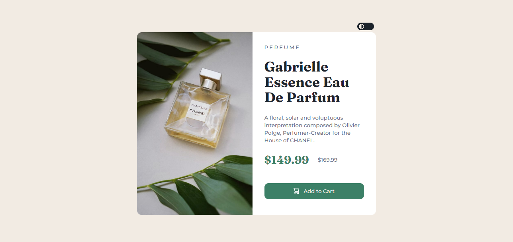
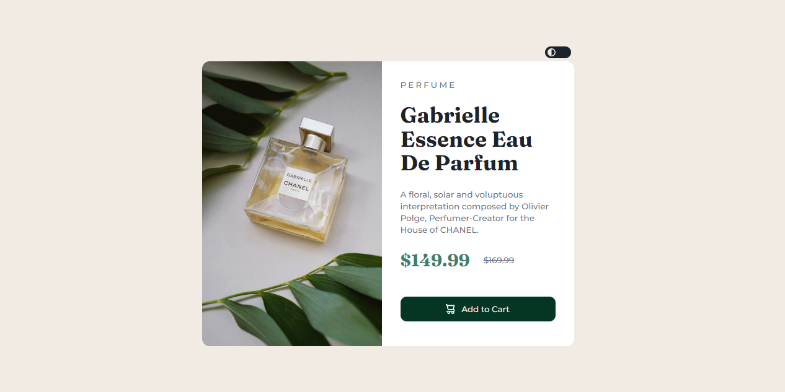

# Frontend Mentor - Product preview card component solution by Maame

This is a solution to the [Product preview card component challenge on Frontend Mentor](https://www.frontendmentor.io/challenges/product-preview-card-component-GO7UmttRfa). Frontend Mentor challenges help you improve your coding skills by building realistic projects. 

## Table of contents

- [Overview](#overview)
  - [Screenshot](#screenshot)
  - [Links](#links)
- [My process](#my-process)
  - [Built with](#built-with)
  - [What I learned](#what-i-learned)
  - [Continued development](#continued-development)
  - [Useful resources](#useful-resources)
- [Author](#author)

**Note: Delete this note and update the table of contents based on what sections you keep.**

## Overview

### The challenge

Users should be able to:

- View the optimal layout depending on their device's screen size
- See hover and focus states for interactive elements

### Screenshot

#### Desktop View

Normal
 

On hover/focus



#### Mobile view

Light
 

Dark


### Links

- Solution URL: [Maame's Product preview card component solution](https://mbonamensa.github.io/fem_qr-code)
- Live Site URL: [Frontend Mentor | Product preview card by Maame](https://mbonamensa.github.io/fem_qr-code)
- Figma file: [I created my own figma file](https://www.figma.com/file/VzGvCzlZrMK1dVmumY9NS5/Frontend-Mentor---Product-preview-card-design?node-id=0%3A1)

## My process

### Built with

- HTML5
- SASS
- JavaScript
- Mobile-first workflow

### What I learned

I practiced using mixins throughout my SASS code and I am learning how important and useful they are in making sure I write DRY code. 


```css
@mixin spacing {
    margin: 20px 0;
    padding: 0 20px;
};
```
My CSS ```background``` properties knowledge was a bit rusty and this project helped me practice.

***This is an update:*** I learnt from the Frontend Mentor community that a better way to render different images for the different screen sizes was to use ```<picture>``` and ```<source>``` elements. The image here is theproduct image which is an important part of the content and therefore should not be set with the CSS ```background-image``` property. Here's how are used it:

```html
 <picture>
    <source media="(min-width: 545px)" srcset="./img/image-product-desktop.jpg">
    
  </picture> 
```

### Continued development

I'm hoping to practice more with other Frontend Mentor challenges


### Useful resources

These resources were useful in helping me build this project

- [HTML Picture Element](https://www.w3schools.com/html/html_images_picture.asp) 
- [CSS background-size Property](https://www.w3schools.com/cssref/css3_pr_background-size.asp) 
- [How to Watch for System Dark Mode Changes Using JavaScript and CSS](https://www.section.io/engineering-education/watch-for-system-dark-mode-using-js-css/) 


## Author

- Website - [Maame Yaa Serwaa Bona-Mensa](https://mbonamensa.netlify.app)
- Frontend Mentor - [@mbonamensa](https://www.frontendmentor.io/profile/yourusername)
- Twitter - [@mys_bm](https://www.twitter.com/mys_mb)
